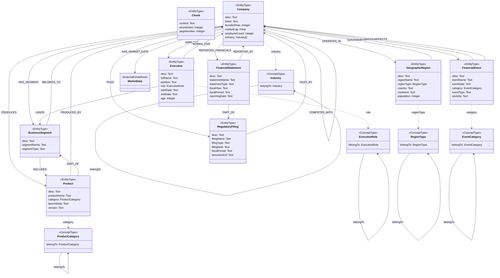

# FinanceBench SPG Schema Visualization

This document provides a visual representation of the schema defined in `financebench_spg.schema`.

## Schema Diagram

```mermaid
classDiagram
    direction TB
    
    %% Concept Types
    class Industry {
        <<ConceptType>>
        belongTo: Industry
    }
    class ExecutiveRole {
        <<ConceptType>>
        belongTo: ExecutiveRole
    }
    class ProductCategory {
        <<ConceptType>>
        belongTo: ProductCategory
    }
    class RegionType {
        <<ConceptType>>
        belongTo: RegionType
    }
    class EventCategory {
        <<ConceptType>>
        belongTo: EventCategory
    }

    %% Entity Types
    class Chunk {
        <<EntityType>>
        content: Text
        chunkIndex: Integer
        pageNumber: Integer
    }

    class Company {
        <<EntityType>>
        desc: Text
        ticker: Text
        foundedYear: Integer
        marketCap: Float
        employeeCount: Integer
        industry: Industry[]
    }

    class Executive {
        <<EntityType>>
        desc: Text
        fullName: Text
        position: Text
        role: ExecutiveRole
        startDate: Text
        endDate: Text
        age: Integer
    }

    class Product {
        <<EntityType>>
        desc: Text
        productName: Text
        category: ProductCategory
        launchDate: Text
        version: Text
    }

    class BusinessSegment {
        <<EntityType>>
        desc: Text
        segmentName: Text
        segmentType: Text
    }

    class GeographicRegion {
        <<EntityType>>
        desc: Text
        regionName: Text
        regionType: RegionType
        country: Text
        continent: Text
        population: Integer
    }

    class FinancialStatement {
        <<EntityType>>
        desc: Text
        statementName: Text
        statementType: Text
        fiscalYear: Text
        fiscalPeriod: Text
        reportingDate: Text
    }

    class FinancialEvent {
        <<EntityType>>
        desc: Text
        eventName: Text
        eventDate: Text
        category: EventCategory
        eventType: Text
        severity: Text
    }

    class RegulatoryFiling {
        <<EntityType>>
        desc: Text
        filingName: Text
        filingType: Text
        filingDate: Text
        fiscalPeriod: Text
        documentUrl: Text
    }

    class MarketData {
        <<External/Undefined>>
    }

    %% Relationships
    Company --> Company : OWNS
    Company --> Company : COMPETES_WITH
    Company --> FinancialStatement : REPORTED_FINANCIALS
    Company --> Executive : EMPLOYS
    Company --> Product : PRODUCES
    Company --> GeographicRegion : OPERATES_IN
    Company --> BusinessSegment : HAS_SEGMENT
    Company --> RegulatoryFiling : FILED
    Company --> FinancialEvent : INVOLVED_IN
    Company --> MarketData : HAS_MARKET_DATA
    
    Executive --> Company : WORKS_FOR
    Executive --> BusinessSegment : LEADS
    Executive ..> ExecutiveRole : role

    Product --> Company : PRODUCED_BY
    Product --> BusinessSegment : PART_OF
    Product ..> ProductCategory : category

    BusinessSegment --> Company : BELONGS_TO
    BusinessSegment --> Product : INCLUDES

    GeographicRegion --> Company : CONTAINS
    GeographicRegion ..> RegionType : regionType

    FinancialStatement --> Company : REPORTED_BY
    FinancialStatement --> RegulatoryFiling : PART_OF
    
    FinancialEvent --> Company : INVOLVES
    FinancialEvent --> Company : AFFECTS
    FinancialEvent ..> EventCategory : category

    RegulatoryFiling --> Company : FILED_BY

    %% Concept Hierarchies
    Industry --> Industry : belongTo
    ExecutiveRole --> ExecutiveRole : belongTo
    ProductCategory --> ProductCategory : belongTo
    RegionType --> RegionType : belongTo
    EventCategory --> EventCategory : belongTo

    %% Type dependencies (attributes pointing to concepts)
    Company ..> Industry : industry
```
